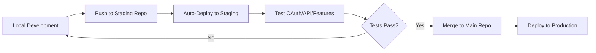

# 🚀 **Comprehensive Staging Setup Plan**

## **📋 Overview**
Create a robust staging environment to test OAuth, API integrations, and deployments without affecting production. This eliminates the need to push to main for testing and provides a safe sandbox for development.

---

## **🏗️ Architecture Overview**

### **Current Production Setup**
- **Frontend**: `getspaced.app` (main repo)
- **Backend**: Render deployment (main repo)
- **OAuth**: Production Google OAuth credentials
- **Issue**: Must push to main to test OAuth/Render features

### **Proposed Staging Setup**
- **Frontend Staging**: `staging.getspaced.app` (separate repo)
- **Backend Staging**: Free tier API deployment (separate repo)
- **OAuth Staging**: Separate Google OAuth credentials
- **Workflow**: Test in staging → merge to main when ready

---

## **🎯 Implementation Plan**

### **Phase 1: Repository Setup**

#### **1.1 Create Staging Repositories**
```bash
# Create staging frontend repo
gh repo create spaced-staging-frontend --public
# Or manually create: github.com/[username]/spaced-staging-frontend

# Create staging backend repo  
gh repo create spaced-staging-backend --public
# Or manually create: github.com/[username]/spaced-staging-backend
```

#### **1.2 Repository Structure**
```
spaced-staging-frontend/
├── flutter_app/          # Copy of current Flutter app
├── .github/workflows/    # Auto-deployment workflows
├── staging.env           # Staging environment config
└── README.md            # Staging-specific setup docs

spaced-staging-backend/
├── backend/             # Copy of current backend
├── .github/workflows/   # Auto-deployment workflows  
├── staging.env          # Staging API keys
└── README.md           # Staging backend docs
```

#### **1.3 Initial Setup Commands**
```bash
# Clone your main repos
git clone [your-main-repo] spaced-main
cd spaced-main

# Copy to staging repos
cp -r flutter_app/* ../spaced-staging-frontend/
cp -r backend/* ../spaced-staging-backend/

# Initialize staging repos
cd ../spaced-staging-frontend
git init
git remote add origin https://github.com/[username]/spaced-staging-frontend.git

cd ../spaced-staging-backend  
git init
git remote add origin https://github.com/[username]/spaced-staging-backend.git
```

---

### **Phase 2: Hosting Setup (Free Tiers)**

#### **2.1 Frontend Staging - Vercel (Recommended)**
**Why Vercel**: 
- ✅ Free tier with custom domains
- ✅ Automatic Flutter web deployments
- ✅ Preview deployments for PRs
- ✅ Easy custom domain setup

**Setup Steps**:
1. **Connect Repo**: Link `spaced-staging-frontend` to Vercel
2. **Domain Setup**: Configure `staging.getspaced.app` subdomain
3. **Build Settings**:
   ```bash
   # Build Command
   cd flutter_app && flutter build web
   
   # Output Directory  
   flutter_app/build/web
   ```
4. **Environment Variables**:
   ```env
   FLUTTER_WEB=true
   STAGING=true
   API_BASE_URL=https://your-staging-api.railway.app
   ```

#### **2.2 Backend Staging - Railway (Recommended)**
**Why Railway**:
- ✅ Free tier with 500 hours/month
- ✅ Easy Python/FastAPI deployment
- ✅ Environment variable management
- ✅ Automatic deployments from GitHub

**Setup Steps**:
1. **Connect Repo**: Link `spaced-staging-backend` to Railway
2. **Environment Variables**:
   ```env
   OPENAI_API_KEY=your_staging_openai_key
   ENVIRONMENT=staging
   CORS_ORIGINS=https://staging.getspaced.app
   ```
3. **Deploy Settings**: Auto-deploy from main branch

#### **2.3 Alternative Hosting Options**

| Service | Frontend | Backend | Free Tier | Pros |
|---------|----------|---------|-----------|------|
| **Vercel** | ✅ | ❌ | Generous | Best for Flutter web |
| **Netlify** | ✅ | ❌ | Good | Great for static sites |
| **Railway** | ✅ | ✅ | 500hrs/mo | Full-stack option |
| **Render** | ✅ | ✅ | Limited | What you're using now |
| **Fly.io** | ✅ | ✅ | 3 apps free | Docker-friendly |

---

### **Phase 3: OAuth Configuration**

#### **3.1 Create Staging OAuth Credentials**

**Google Cloud Console Setup**:
1. **Create New Project**: `spaced-staging` (or use existing)
2. **Enable APIs**: Google Sign-In API
3. **Create OAuth Credentials**:
   - **Application Type**: Web application
   - **Name**: `Spaced Staging`
   - **Authorized JavaScript Origins**: 
     - `https://staging.getspaced.app`
     - `http://localhost:3000` (for local testing)
   - **Authorized Redirect URIs**:
     - `https://staging.getspaced.app/__/auth/handler`
     - `http://localhost:3000/__/auth/handler`

#### **3.2 Firebase Staging Setup**
1. **Create Staging Project**: `spaced-staging` 
2. **Configure Authentication**:
   - Enable Google provider
   - Add staging OAuth client ID
   - Configure authorized domains: `staging.getspaced.app`
3. **Generate Config**: Download `firebase_options_staging.dart`

#### **3.3 Environment-Based Configuration**
```dart
// lib/config/firebase_config.dart
class FirebaseConfig {
  static FirebaseOptions get currentPlatform {
    if (kDebugMode || isStaging) {
      return FirebaseOptions.staging;
    }
    return FirebaseOptions.production;
  }
}
```

---

### **Phase 4: API Testing Infrastructure**

#### **4.1 Automated API Testing**
```yaml
# .github/workflows/api-test.yml
name: API Tests
on: [push, pull_request]
jobs:
  test:
    runs-on: ubuntu-latest
    steps:
      - uses: actions/checkout@v3
      - name: Test API Endpoints
        run: |
          # Test health endpoint
          curl -f https://your-staging-api.railway.app/health
          
          # Test CORS
          curl -H "Origin: https://staging.getspaced.app" \
               -f https://your-staging-api.railway.app/start_session
```

#### **4.2 Frontend API Integration Tests**
```dart
// test/integration/api_test.dart
void main() {
  group('Staging API Integration', () {
    testWidgets('OAuth flow works', (tester) async {
      // Test Google OAuth button
      // Verify API calls succeed
      // Check authentication state
    });
    
    testWidgets('Chat API works', (tester) async {
      // Test start_session endpoint
      // Test message sending
      // Verify responses
    });
  });
}
```

---

### **Phase 5: Development Workflow**

#### **5.1 Feature Development Cycle**


#### **5.2 Testing Checklist Template**
```markdown
## Staging Test Checklist
- [ ] OAuth sign-in works on staging.getspaced.app
- [ ] API endpoints respond correctly
- [ ] Chat feature works end-to-end
- [ ] Mobile responsive design (browser dev tools)
- [ ] No console errors in browser
- [ ] CORS configured correctly
- [ ] Authentication state persists
```

#### **5.3 Automated Staging Deployment**
```yaml
# .github/workflows/staging-deploy.yml
name: Deploy to Staging
on:
  push:
    branches: [main, staging]
jobs:
  deploy:
    runs-on: ubuntu-latest
    steps:
      - uses: actions/checkout@v3
      - name: Deploy to Vercel
        uses: amondnet/vercel-action@v20
        with:
          vercel-token: ${{ secrets.VERCEL_TOKEN }}
          vercel-org-id: ${{ secrets.ORG_ID }}
          vercel-project-id: ${{ secrets.PROJECT_ID }}
```

---

### **Phase 6: Advanced Testing Features**

#### **6.1 Cross-Device Testing Setup**
```bash
# Local network testing (future mobile testing)
flutter run -d web-server --web-hostname 0.0.0.0 --web-port 3000

# Test on phone browser: http://[your-ip]:3000
# Test OAuth with staging credentials
```

#### **6.2 Performance Monitoring**
- **Lighthouse CI**: Automated performance testing
- **Sentry**: Error tracking in staging
- **LogRocket**: Session replay for debugging

#### **6.3 Database Staging**
```bash
# Separate staging database (if needed later)
# Firebase: Create staging Firestore instance
# PostgreSQL: Free tier on Railway/Render
```

---

## **🚀 Quick Start Implementation**

### **Week 1: Core Setup**
1. **Day 1-2**: Create staging repos and connect to Vercel/Railway
2. **Day 3**: Configure staging OAuth credentials
3. **Day 4-5**: Test basic deployment and OAuth flow

### **Week 2: Automation**
1. **Day 1-2**: Set up automated deployments
2. **Day 3-4**: Create API testing pipeline
3. **Day 5**: Document workflow and test end-to-end

---

## **💰 Cost Breakdown (All Free Tiers)**

| Service | Cost | Limits | Notes |
|---------|------|--------|-------|
| **Vercel** | Free | 100GB bandwidth/mo | Perfect for staging |
| **Railway** | Free | 500 hours/mo | ~20 days uptime |
| **GitHub** | Free | Unlimited public repos | For CI/CD |
| **Google OAuth** | Free | Unlimited for staging | Separate credentials |
| **Firebase** | Free | Generous quotas | For staging auth |

**Total Monthly Cost**: $0 🎉

---

## **🔧 Tools & Services Summary**

### **Recommended Stack**
- **Frontend Hosting**: Vercel
- **Backend Hosting**: Railway  
- **Domain**: `staging.getspaced.app` (subdomain)
- **OAuth**: Separate Google Cloud project
- **CI/CD**: GitHub Actions
- **Monitoring**: Built-in platform tools

### **Alternative Options**
- **All-in-One**: Railway (frontend + backend)
- **Traditional**: Netlify + Render
- **Advanced**: Docker + Fly.io

---

## **📱 Future Mobile Testing**

### **Phase 7: Mobile Integration (Future)**
```bash
# iOS Testing (requires Mac)
flutter build ios
# Test with staging OAuth on physical device

# Android Testing  
flutter build apk --debug
# Install on Android device for testing

# Web Mobile Testing (Current)
# Use browser dev tools mobile simulation
# Test responsive design on staging.getspaced.app
```

---

## **🎯 Success Metrics**

### **Goals**
- ✅ Test OAuth without pushing to main
- ✅ Validate API changes in staging
- ✅ Catch issues before production
- ✅ Faster development cycle
- ✅ Zero cost implementation

### **Key Performance Indicators**
- **Time to Test**: < 5 minutes (vs current push-to-main)
- **Deployment Time**: < 3 minutes automatic
- **Issue Detection**: Catch 90%+ of bugs in staging
- **Developer Experience**: Seamless testing workflow

---

## **📋 Next Steps**

1. **Review this plan** and confirm approach
2. **Create staging repositories** (15 minutes)
3. **Set up Vercel + Railway** (30 minutes)  
4. **Configure staging OAuth** (45 minutes)
5. **Test end-to-end flow** (30 minutes)
6. **Document workflow** (20 minutes)

**Total Setup Time**: ~2.5 hours for complete staging environment

---

## **❓ Questions for Refinement**

1. **Domain Preference**: Use `staging.getspaced.app` or different subdomain?
2. **Hosting Services**: Prefer Vercel+Railway or other combination?
3. **Automation Level**: Want automatic deploys or manual control?
4. **Testing Scope**: Start with OAuth+API or include full E2E testing?
5. **Repository Strategy**: Separate repos vs branches in main repo?

Ready to implement this plan? We can start with the repository setup and work through each phase systematically! 