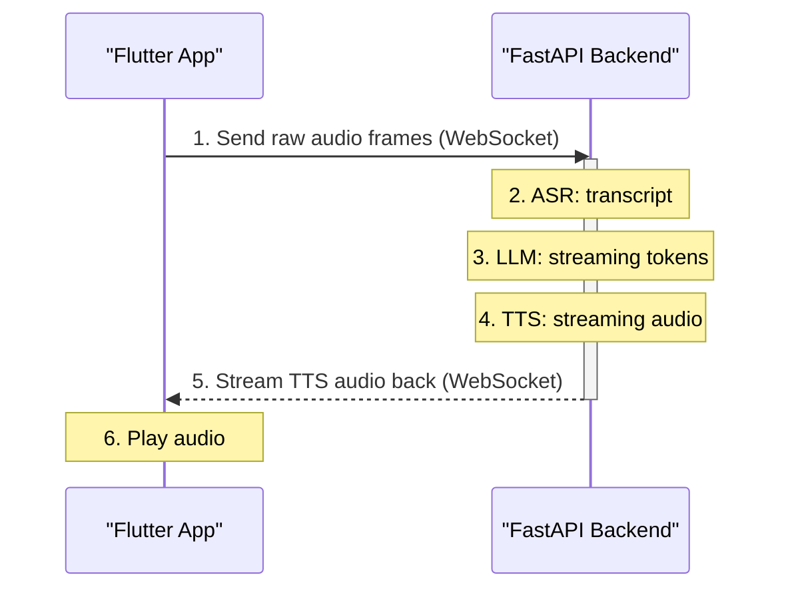

# Speak-to-Chat Feature Implementation Plan

Below is a comprehensive, step-by-step plan to add a "speak-to-chat" feature with a Flutter front-end and Python (FastAPI) back-end. It covers both a quick, non-streaming POC and a full low-latency streaming pipeline.

## 1. High-Level Architecture

*   **Flutter app**
    *   Capture microphone audio
    *   Send raw audio frames to backend over WebSocket
    *   Display live transcript (optional)
    *   Play back TTS audio streamed from backend
*   **Python FastAPI service**
    *   WebSocket endpoint(s) for audio in / audio out
    *   ASR engine: Whisper (via whisper.cpp) or OpenAI Speech-to-Text
    *   Chat: OpenAI Chat Completions API (with stream=True)
    *   TTS engine: Google Cloud TTS / Amazon Polly / Coqui TTS
    *   Orchestration layer gluing ASR → LLM → TTS

**Sequence Diagram:**



## 2. Tech Stack & Libraries
| Layer          | Flutter                               | Python (FastAPI)                                 |
| -------------- | ------------------------------------- | ------------------------------------------------ |
| Audio Capture  | `flutter_sound` or `record`             |                                                  |
| Websockets     | `web_socket_channel`                  | `fastapi[websockets]`, `uvicorn`                 |
| ASR            |                                       | `whispercpp` (pybind) or direct OpenAI audio API |
| Chat           |                                       | `openai` Python SDK                              |
| TTS            |                                       | Google Cloud TTS / Amazon Polly / `coqui-ai/tts`   |
| Playback       | `flutter_sound` or `just_audio`       |                                                  |
| Deployment     |                                       | Docker + Nginx (for proxying WebSockets)         |

## 3. Project Integration Notes

This plan introduces new components. Here's how they can be integrated into the existing project structure:

**Backend (FastAPI):**

*   **WebSocket Endpoint:** The new `/ws/voice` endpoint can be implemented in a new file: `src/backend/api/v1/endpoints/voice.py` and included in the router at `src/backend/api/v1/router.py`.
*   **Services:** The logic for ASR, TTS, and orchestration should be encapsulated in new services within the `src/backend/core/services/` directory. For example: `asr_service.py`, `tts_service.py`.

**Frontend (Flutter):**

*   **UI:** A new screen or set of widgets should be created under `lib/screens/` or `lib/widgets/` to house the voice chat interface (e.g., a microphone button, transcript display).
*   **State Management:** A new provider, `voice_chat_provider.dart`, could be created in `lib/providers/` to manage the state of the voice session, including the WebSocket connection, recording status, and streaming audio playback.
*   **Dependencies:** The new dependencies listed in the plan will need to be added to `flutter_app/pubspec.yaml`.

## 4. Phase 1: Proof-of-Concept (Batch)

Flutter:
1.  Record fixed-duration audio (e.g. 5 s) to a WAV/PCM buffer.
2.  Send via HTTP POST to `/transcribe-and-chat`.

FastAPI:
1.  `POST /transcribe-and-chat` handler:
    1.  Save incoming audio file (or read bytes).
    2.  Call OpenAI Speech-to-Text:
        ```python
        transcript = openai.Audio.transcribe("whisper-1", audio_bytes)
        ```
    3.  Send transcript to `openai.ChatCompletion.create(stream=False)`.
    4.  Collect full chat response.
    5.  Call TTS (e.g. Google TTS) on that text → MP3/PCM bytes.
    6.  Return JSON `{ transcript, chat, tts_audio_base64 }`.

Flutter:
1.  Display transcript & chat text.
2.  Decode base64 audio and play.

**Goal:** validate end-to-end voice → text → chat → speech in ~3–5 s.

## 5. Phase 2: Low-Latency Streaming Pipeline

### 5.1. Backend: FastAPI WS Endpoints
```python
from fastapi import FastAPI, WebSocket

app = FastAPI()

@app.websocket("/ws/voice")
async def ws_voice(ws: WebSocket):
    await ws.accept()
    # 1. Receive PCM frames from Flutter
    # 2. Push to ASR engine (buffer & partials)
    # 3. On ASR 'final', forward to LLM stream
    # 4. Receive LLM tokens → push to TTS pipeline
    # 5. Send TTS audio frames back over ws
```

### 5.2. ASR Integration
*   **Option A: whisper.cpp**
    *   Build `whisper.cpp` Python bindings; call `model.transcribe_stream()` on incoming PCM.
    *   Emit partial transcripts on each chunk.
*   **Option B: OpenAI Audio API (non-streaming)**
    *   Buffer until VAD-detected pause, then hit `/audio/transcriptions.create`.
    *   Simpler, but adds 1–2 s overhead.

Implement an `ASRHandler` class that:
*   Buffers 20 ms frames.
*   Runs VAD on each frame.
*   Streams to Whisper for partials; finalizes on silence.
*   Emits `on_final_text(text)` callback.

### 5.3. LLM Streaming
Use OpenAI's Chat API with streaming:
```python
import openai

async for chunk in openai.ChatCompletion.acreate(
    model="gpt-4o-audio-preview",
    messages=[{"role":"user","content":final_text}],
    stream=True,
):
    token = chunk.choices[0].delta.get("content", "")
    await tts_handler.enqueue_text(token)
```
Each token is immediately sent to the TTS queue.

### 5.4. TTS Streaming
Coqui TTS:
```python
from coqui_tts import TTSModel
tts = TTSModel("tts_models/en/vctk/vits")
# provide callback that yields audio frames:
tts.generate_stream(text_chunk, callback=on_audio_frame)
```
Cloud TTS: Google/Polly both support streaming out.

Implement a `TTSHandler` that:
*   Accepts token chunks.
*   Buffers until a small sentence (e.g. 20–30 tokens) or punctuation.
*   Calls TTS streaming endpoint.
*   Pushes resulting PCM frames to WS client.

### 5.5. Putting It All Together
Voice WS: multiplex messages:
```json
// from client
{ "type": "audio", "data": "<PCM bytes>" }

// from server
{ "type": "partial_transcript", "text": "Hello, how" }
{ "type": "final_transcript",   "text": "Hello, how are you?" }
{ "type": "tts_audio",         "data": "<PCM bytes>" }
```
Maintain per-socket state: ASR buffer, LLM session, TTS queue.

## 6. Flutter Frontend

### 6.1. Dependencies
```yaml
dependencies:
  flutter_sound: ^8.4.0
  web_socket_channel: ^2.3.0
  just_audio: ^0.9.30
```

### 6.2. Audio Capture & Streaming
Initialize recorder:
```dart
final recorder = FlutterSoundRecorder();
await recorder.openAudioSession();
await recorder.startRecorder(
  toStream: true,
  codec: Codec.pcm16,
  sampleRate: 16000,
  numChannels: 1,
);
```

WebSocket:
```dart
final ws = WebSocketChannel.connect(Uri.parse("wss://yourapi/ws/voice"));
// On recorder stream:
recorder.onProgress!.listen((e) {
  ws.sink.add(e.data); // PCM bytes
});
```
Receive & dispatch messages:
```dart
ws.stream.listen((msg) {
  final m = json.decode(msg);
  switch (m['type']) {
    case 'partial_transcript': showInterim(m['text']); break;
    case 'final_transcript':   addUserBubble(m['text']); break;
    case 'tts_audio':          playAudio(m['data']); break;
  }
});
```

### 6.3. Audio Playback
Use `just_audio` to play raw PCM:
```dart
final player = AudioPlayer();
// convert base64/bytes to AudioSource and play
```

## 7. Deployment & Scaling
*   Containerize both services (Flutter as static assets on nginx; FastAPI + Uvicorn).
*   Ingress: Nginx proxy for `/` (Flutter) and `/ws/voice` (WebSocket).
*   Autoscaling: ASR & TTS are CPU/GPU-heavy—use Kubernetes with node pools.
*   Monitoring: instrument latency at each stage (ASR time, LLM time, TTS time).
*   Fallback: detect high load → degrade to non-streaming mode (batch record).

## 8. Testing & QA
*   Unit tests for `ASRHandler`, `TTSHandler`, state machine transitions.
*   Integration tests using prerecorded audio clips to validate full pipeline.
*   Manual QA: real-user tests on poor networks, noisy rooms.
*   Metrics: end-to-end latency ≤ 600 ms for short utterances. 